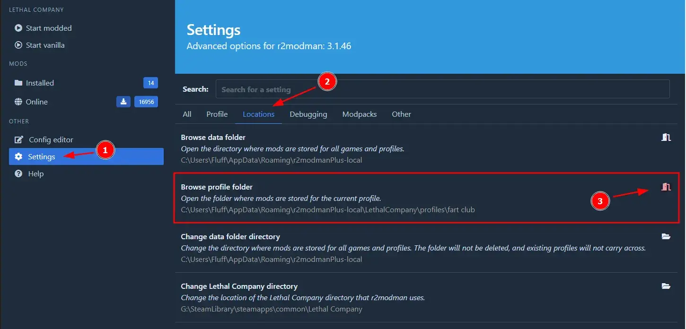

# LCOnlineFix

Lethal Company mod to be able to play with other unofficial copies. ("online-fix")

## Usage

This requires a build of Lethal Company. If you have a friend that owns it on Steam,
then you can ask them to bundle up and send you their installation!

1. Obtain a build of the latest version of Lethal Company. Examples:
    - An official copy from Steam
    - A copy from a friend's Steam installation who has already bought it
2. Download the plugin `dll` from the
   [releases](https://github.com/rushiiMachine/LCOnlineFix/release/latest/LCOnlineFix.dll) page.
3. If you plan on using additional mods, then you should consider using [r2modman](#r2modman).
4. Otherwise, use the [manual](#manual) installation method.
5. When playing, make sure that Steam is running in the background.

### Manual

1. Obtain a build of the latest version of Lethal Company. Examples:
    - An official copy from Steam
    - A copy from a friend's Steam installation who has already bought it
2. Manually install BepInEx into your Lethal Company installation by following the
    [BepInEx guide](https://docs.bepinex.dev/articles/user_guide/installation/index.html)
3. Launch Lethal Company once to ensure BepInEx is being loaded.
4. Navigate to the `BepInEx/plugins` directory in your installation
5. Move the downloaded `LCOnlineFix.dll` into the directory

### r2modman

This assumes you already have r2modman installed. Note that using it with an unofficial copy of Lethal Company
requires using a fork; the official r2modman does not support non-steam game installations.

1. Open r2modman and select your Lethal Company profile
2. Open the profile's directory

3. Navigate to the `BepInEx/plugins` directory
4. Move the downloaded `LCOnlineFix.dll` into the directory

Note that if you wish to play with someone without the online fix, then you will have to move the `dll` out of
the `plugins` directory! Disabling it through r2modman is not possible.

## Credits

Based on megu's [LethalCompanyOnlinePatch](https://github.com/MeguminSama/LethalCompanyOnlinePatch)
